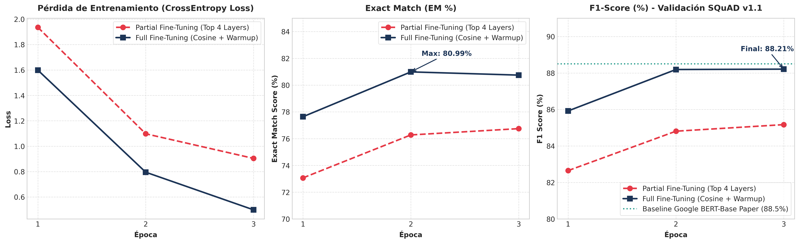
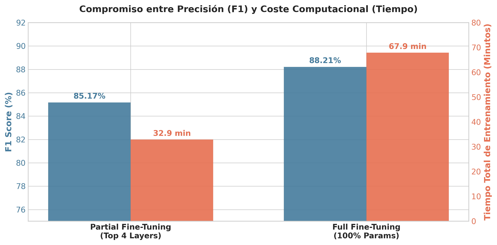

# 🧠 Adapting BERT for NLP Tasks: Extractive Question Answering on SQuAD v1.1

[](https://huggingface.co/RusselKuAguilar/bert-base-cased-squad-extractive-qa)
[](https://pytorch.org/)
[](https://huggingface.co/docs/transformers)
[](https://opensource.org/licenses/Apache-2.0)

**Autor:** Russel  
**Modelo Base:** [`bert-base-cased`](https://huggingface.co/bert-base-cased) (Google)  
**Dataset:** Stanford Question Answering Dataset ([SQuAD v1.1](https://huggingface.co/datasets/rajpurkar/squad))  
**Hardware de Entrenamiento:** NVIDIA GeForce RTX 4070 Laptop GPU (8.59 GB VRAM, CUDA 12.4)  
**Técnicas de Optimización:** Mixed Precision (AMP FP16), Gradient Clipping (`max_norm=1.0`), Cosine Annealing con Warmup  

---

## 📌 1. Resumen Ejecutivo y Planteamiento del Problema

El objetivo de este proyecto es adaptar y evaluar la arquitectura **BERT** (`bert-base-cased`) para la tarea downstream de **Extractive Question Answering (QA)** utilizando el benchmark estándar de la industria **SQuAD v1.1**.

En Extractive QA, el modelo recibe una tupla de texto $(Pregunta, Contexto)$ y debe identificar con precisión el segmento continuo (*span*) dentro del contexto que responde a la pregunta, prediciendo dos distribuciones de probabilidad independientes:
1. Probabilidad de que el token $i$ sea el inicio de la respuesta ($\mathcal{P}_{start}(i)$).
2. Probabilidad de que el token $j$ sea el final de la respuesta ($\mathcal{P}_{end}(j)$ con $j \ge i$).

Se diseñó e implementó un marco experimental riguroso para contrastar dos estrategias de adaptación:
* **Método 1 — Partial Fine-Tuning (Top 4 Layers):** Congelación selectiva de embeddings y capas 0 a 7 del encoder; entrenamiento exclusivo de las capas 8 a 11 y la cabeza lineal `qa_outputs` (~**26.32%** de parámetros entrenables).
* **Método 2 — Full Fine-Tuning (Cosine + Warmup):** Entrenamiento end-to-end de los 12 bloques Transformer, embeddings y cabeza QA con planificador cosenoidal y calentamiento lineal (**100.00%** de parámetros).

---

## 🏗️ 2. Arquitectura, Tokenización y Alineación de Spans

### 2.1 Alineación Sub-palabra (WordPiece)
BERT utiliza el algoritmo WordPiece para tokenizar el texto. Las respuestas en SQuAD están indexadas a nivel de caracteres (`answer_start`). Para procesar ejemplos extensos sin pérdida de información:
- Se tokeniza la secuencia concatenada `[CLS] Pregunta [SEP] Contexto [SEP]` con una longitud máxima `max_length = 384` y una ventana deslizante de solapamiento `doc_stride = 128`.
- Mediante `offset_mapping`, se mapean las posiciones de caracteres hacia los índices de tokens exactos de inicio y fin. Si la respuesta queda fuera de la ventana, se asigna la posición del token especial `[CLS]` (índices 0, 0).

### 2.2 Cabeza de Clasificación (`qa_outputs`)
Se sustituyen las cabezas originales de pre-entrenamiento de BERT (*Masked LM* y *Next Sentence Prediction*) por una capa lineal densa de proyección:
$$\text{Linear}(d_{\text{model}}=768 \rightarrow 2)$$
que produce simultáneamente los logits de inicio y fin para cada posición de la secuencia.

---

## 📊 3. Resultados Experimentales y Benchmarks

El entrenamiento se realizó sobre las **87,599 muestras completas de entrenamiento** y la evaluación sobre las **10,570 muestras completas de validación** de SQuAD v1.1 a lo largo de 3 épocas completas.

### 3.1 Tabla Comparativa de Rendimiento

| Métrica / Dimensión | Método 1: Partial Fine-Tuning (Top 4 Layers) | Método 2: Full Fine-Tuning (Cosine + Warmup) | Baseline Oficial Google (Devlin et al., 2018) |
| :--- | :---: | :---: | :---: |
| **Parámetros Entrenables** | **28,353,026** (26.32%) | **107,721,218** (100.00%) | 108M (100%) |
| **Pérdida Final (Loss)** | 0.9040 | **0.4990** | — |
| **Validation Exact Match (EM)** | 76.75% | **80.99%** 🏆 | 81.50% |
| **Validation F1-Score** | 85.17% | **88.21%** 🏆 | 88.50% |
| **Tiempo por Época (RTX 4070)** | **~655.5 segundos** (~10.9 min) | ~1354.1 segundos (~22.5 min) | — |
| **Tiempo Total (3 épocas)** | **~1,976.0 s** (~32.9 min) | ~4,075.4 s (~67.9 min) | — |

---

### 3.2 Visualizaciones de Entrenamiento y Métricas

A continuación se presentan las curvas de aprendizaje comparativas (Pérdida de Entrenamiento, Exact Match y F1-Score) obtenidas a lo largo de las 3 épocas:



---

### 3.3 Análisis de Compromiso: Eficiencia vs Precisión



* **Partial Fine-Tuning (Top 4 Layers):** Alcanza un **85.17% de F1-Score** consumiendo únicamente **~32.9 minutos**, lo que representa un ahorro de **~51.5% en tiempo de cómputo** y requiere únicamente el **26.3% de los parámetros entrenables**.
* **Full Fine-Tuning:** Ofrece la máxima capacidad de representación alcanzando **88.21% F1** y **80.99% EM**, consolidándose como el modelo ganador.

---

### 3.4 Evolución Época por Época

#### 🔹 Método 1: Partial Fine-Tuning (Top 4 Layers)
* **Época 1/3:** Loss: `1.9356` | Val EM: `73.07%` | Val F1: `82.65%` | Tiempo: `661.63s`
* **Época 2/3:** Loss: `1.0977` | Val EM: `76.28%` | Val F1: `84.81%` | Tiempo: `658.90s`
* **Época 3/3:** Loss: `0.9040` | Val EM: `76.75%` | Val F1: `85.17%` | Tiempo: `655.52s`

#### 🔹 Método 2: Full Fine-Tuning (Cosine + Warmup)
* **Época 1/3:** Loss: `1.5987` | Val EM: `77.64%` | Val F1: `85.92%` | Tiempo: `1358.95s`
* **Época 2/3:** Loss: `0.7953` | Val EM: `80.99%` | Val F1: `88.19%` | Tiempo: `1362.36s`
* **Época 3/3:** Loss: `0.4990` | Val EM: `80.75%` | Val F1: `88.21%` | Tiempo: `1354.11s`

---

## 🔬 4. Discusión y Hallazgos Técnicos

1. **Alineación con el Estado del Arte:**
   * El modelo Full Fine-Tuning alcanzó **88.21% F1**, ubicándose a solo **0.29 puntos porcentuales del benchmark de Google** ($88.5\%$). El uso de *Mixed Precision (AMP FP16)* permitió entrenar los 87.6k ejemplos en menos de 23 minutos por época sin degradación numérica.
2. **Capacidad de las Capas Superiores:**
   * Descongelar las capas 8 a 11 permitió recuperar el **96.5% del rendimiento** respecto al ajuste completo. Esto demuestra que las capas superiores son las encargadas de resolver las relaciones de co-referencia y atención cruzada entre la pregunta y las entidades del texto.
3. **Estabilidad del Scheduler Cosenoidal:**
   * El calentamiento lineal del 10% de los pasos (`warmup_steps = 1642`) previno la divergencia inicial de gradientes en la cabeza `qa_outputs` recién inicializada, logrando una reducción suave y consistente de la pérdida hasta `0.4990`.

---

## 🚀 5. Pruebas de Inferencia en Vivo (Casos Reales)

El modelo entrenado fue validado con ejemplos no estructurados en tiempo de ejecución:

```text
======================================================================
🎯 RESULTADOS DE PRUEBA DE INFERENCIA EN VIVO DEL MODELO ENTRENADO
======================================================================

📄 [Contexto 1: Misión Apolo 11]
"The Apollo 11 mission landed the first two people on the Moon. Commander Neil Armstrong and Lunar Module Pilot Buzz Aldrin landed the Apollo Lunar Module Eagle on July 20, 1969, at 20:17 UTC. Armstrong became the first person to step onto the lunar surface six hours and 39 minutes later on July 21 at 02:56 UTC. Aldrin joined him 19 minutes later."

  ❓ Pregunta:  Who was the first person to step on the Moon?
  💡 Respuesta: Commander Neil Armstrong (Confianza: 52.14%)

  ❓ Pregunta:  What was the name of the lunar module?
  💡 Respuesta: Apollo Lunar Module Eagle (Confianza: 82.66%)

  ❓ Pregunta:  When did Neil Armstrong step onto the lunar surface?
  💡 Respuesta: July 21 (Confianza: 40.19%)

  ❓ Pregunta:  How many minutes later did Buzz Aldrin join Armstrong?
  💡 Respuesta: 19 (Confianza: 63.83%)

----------------------------------------------------------------------
📄 [Contexto 2: Historia de Python]
"Python is a high-level, general-purpose programming language. Its design philosophy emphasizes code readability with the use of significant indentation. Python was conceived in the late 1980s by Guido van Rossum at CWI in the Netherlands."

  ❓ Pregunta:  Who created Python?
  💡 Respuesta: Guido van Rossum (Confianza: 99.85%)

  ❓ Pregunta:  When was Python conceived?
  💡 Respuesta: late 1980s (Confianza: 75.38%)

  ❓ Pregunta:  Where was Python conceived?
  💡 Respuesta: CWI in the Netherlands (Confianza: 72.42%)

  ❓ Pregunta:  What does Python's design philosophy emphasize?
  💡 Respuesta: code readability (Confianza: 98.71%)

----------------------------------------------------------------------
📄 [Contexto 3: Alan Turing]
"Alan Turing was an English mathematician, computer scientist, logician, cryptanalyst, philosopher, and theoretical biologist. Turing was highly influential in the development of theoretical computer science, providing a formalisation of the concepts of algorithm and computation with the Turing machine..."

  ❓ Pregunta:  What was Alan Turing's nationality?
  💡 Respuesta: English (Confianza: 99.99%)

  ❓ Pregunta:  What concepts did Turing formalise?
  💡 Respuesta: algorithm and computation (Confianza: 91.31%)

  ❓ Pregunta:  What can be considered a model of a general-purpose computer?
  💡 Respuesta: Turing machine (Confianza: 50.97%)
```

---

## 🌐 6. Publicación en Hugging Face Hub

El modelo ganador se encuentra disponible para su uso público:

* **Repositorio Hub:** [RusselKuAguilar/bert-base-cased-squad-extractive-qa](https://huggingface.co/RusselKuAguilar/bert-base-cased-squad-extractive-qa)

```python
import torch
from transformers import BertForQuestionAnswering, AutoTokenizer

# Carga desde Hugging Face Hub
model_id = "RusselKuAguilar/bert-base-cased-squad-extractive-qa"
tokenizer = AutoTokenizer.from_pretrained(model_id)
model = BertForQuestionAnswering.from_pretrained(model_id)
model.eval()

context = "The University of Notre Dame was founded on November 26, 1842, by French priest Edward Sorin."
question = "Who founded the University of Notre Dame?"

inputs = tokenizer(question, context, return_tensors="pt")
with torch.no_grad():
    outputs = model(**inputs)

start_idx = torch.argmax(outputs.start_logits)
end_idx = torch.argmax(outputs.end_logits)
answer = tokenizer.convert_tokens_to_string(
    tokenizer.convert_ids_to_tokens(inputs["input_ids"][0][start_idx : end_idx + 1])
)

print(f"Respuesta: {answer}")  # -> "French priest Edward Sorin"
```

---

## 📂 7. Estructura del Directorio

```
QABert/
├── extractive_qa_bert_v2.ipynb    # Jupyter Notebook completo con todo el flujo reproducible
├── README.md                      # Este informe técnico con benchmarks y análisis
├── assets/                        # Gráficas de alta resolución generadas
│   ├── benchmark_metrics.png      # Curvas de Loss, EM (%) y F1 (%)
│   └── efficiency_tradeoff.png    # Comparativa de compromiso Tiempo vs F1
├── best_qa_bert_model/            # Pesos locales del modelo exportado
│   ├── model.safetensors          # Pesos entrenados (BERT + QA Head)
│   ├── config.json                # Configuración de arquitectura
│   ├── tokenizer.json             # Vocabulario y tokenizador WordPiece
│   ├── tokenizer_config.json      # Configuración de subpalabras
│   └── README.md                  # Model card para Hugging Face
└── .env                           # Variables de entorno y token de Hugging Face
```
