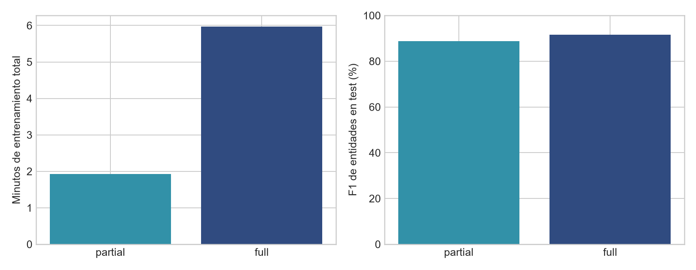
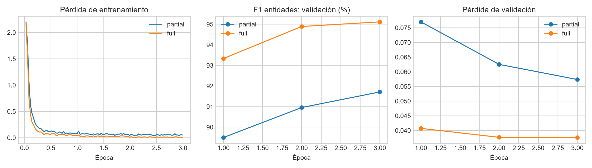
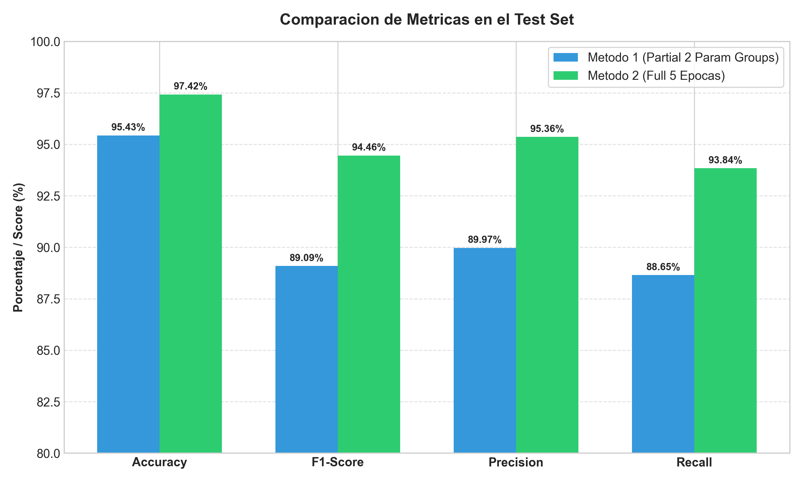

# U2T01 — Adapting BERT for NLP Tasks

## 1. Introduction

BERT demonstrated that a single pretrained Transformer encoder can be adapted to multiple NLP tasks by modifying the task-specific head and deciding how much of the pretrained body should be updated.

In this project, the team evaluated different BERT adaptation strategies on four classical NLP tasks:

- Topic Classification — AG News
- Named Entity Recognition — CoNLL-2003
- Part-of-Speech Tagging — Universal Dependencies English EWT
- Extractive Question Answering — SQuAD v1.1

The objective was not only to obtain competitive predictive performance, but also to empirically compare the benefits and computational costs of different adaptation strategies, including feature-based adaptation, partial fine-tuning, and full fine-tuning.

For every task, at least two configurations were experimentally compared. The selected model was determined from the measured results rather than assumed beforehand.

## 2. Experimental Methodology

### 2.1 Base Architecture

All delivered neural models use a BERT-base architecture.

The team used:

- `bert-base-cased` for NER, POS Tagging, and Extractive QA.
- `bert-base-uncased` for Topic Classification.

The BERT encoder contains approximately 110 million parameters and was adapted with a task-specific classification or prediction head.

### 2.2 Adaptation Strategies

Three adaptation strategies were represented across the project:

**Feature-based adaptation**

BERT remains frozen and its hidden representations are used as features for another classifier.

**Partial fine-tuning**

The task head and only the highest encoder layers are trained, while the remaining pretrained BERT layers stay frozen.

**Full fine-tuning**

The task head and the complete BERT encoder are jointly optimized.

When pretrained encoder parameters and a newly initialized task head were trained together, separate learning rates were used:

- Task-specific head: approximately `1e-3`
- Pretrained BERT encoder: approximately `2e-5` to `3e-5`

This separation protects the pretrained representations from excessively large gradient updates while allowing the new task-specific head to learn rapidly.

### 2.3 Reproducibility

The experiments used fixed random seeds, generally `42`.

The team recorded, where available:

- dataset and split information;
- learning rates;
- number of epochs;
- batch size;
- trainable parameters;
- training and evaluation loss;
- task-specific evaluation metrics;
- execution time;
- hardware and software environment.

Only one run per configuration was performed. Consequently, differences near the expected random-seed variability range should be interpreted cautiously rather than as universal differences between adaptation methods.

### 2.4 Evaluation Metrics and Rationale

Different metrics were used because the four NLP tasks have different output
structures and different failure modes.

| Task | Main Metrics | Rationale |
|---|---|---|
| Named Entity Recognition | Strict entity-level F1, Precision, Recall | Entity-level F1 evaluates whether complete entity spans and their types are predicted correctly. Token accuracy is secondary because the frequent `O` label can make accuracy appear high even when entities are missed. |
| Part-of-Speech Tagging | Macro F1, Accuracy, Precision, Recall | Accuracy measures overall token correctness, while Macro F1 gives equal importance to the 17 UPOS classes and reduces domination by frequent grammatical categories. |
| Extractive Question Answering | Exact Match (EM), token-level F1 | EM measures whether the predicted answer span exactly matches the reference answer. F1 gives partial credit when the predicted span overlaps with the correct answer but is not an exact match. |
| Topic Classification | Accuracy, Macro F1 | AG News contains four balanced classes, making Accuracy directly interpretable. Macro F1 is reported as a complementary class-balanced metric and allows class-level behavior to be inspected. |

Training diagnostics such as loss, scores across epochs, execution time, and,
where available, trainable parameters and GPU-memory usage were also recorded.
These diagnostics were used to verify learning progress and compare the
computational cost of the adaptation strategies.

### 2.5 Training Diagnostics Summary

Training diagnostics were retained to complement the final task metrics and
to verify that each adaptation strategy actually learned during optimization.

| Task | Configuration | Epochs | Recorded Training Loss* | Main Score | Training Time |
|---|---|---:|---:|---:|---:|
| NER | Partial Fine-Tuning | 3 | 0.1365 | 91.71% Validation F1 | 115.63 s |
| NER | Full Fine-Tuning | 3 | 0.0853 | 95.11% Validation F1 | 358.54 s |
| POS | Partial Fine-Tuning | 3 | 0.1336 | 89.09% Test Macro F1 | 173.45 s |
| POS | Full Fine-Tuning | 5 | 0.01297 | 94.46% Test Macro F1 | 123.40 s |
| QA | Partial Fine-Tuning | 3 | 0.9040 | 85.17% Validation F1 | 1976.1 s |
| QA | Full Fine-Tuning | 3 | 0.4990 | 88.21% Validation F1 | 4075.4 s |
| Topic | Frozen BERT + Logistic Regression | N/A | N/A | 90.36% Accuracy | 222.54 s |
| Topic | Full Fine-Tuning | 1 | 0.1891 | 94.58% Accuracy | 2889.20 s |

*Loss values are reported according to each experiment's original logging
implementation. NER and Topic use the training summary reported by their
Trainer workflow, while the POS and QA entries correspond to the recorded
end-of-epoch/final-epoch training loss. They are therefore useful as training
diagnostics but should not be treated as perfectly standardized cross-task
quantities.*

For NER, the recorded training throughput was approximately 22.80 optimizer
steps per second for Partial Fine-Tuning and 7.35 steps per second for Full
Fine-Tuning. Peak allocated VRAM was approximately 0.76 GiB and 2.42 GiB,
respectively.

For QA, the Partial configuration required approximately 662, 659, and
656 seconds across its three epochs, while the Full configuration required
approximately 1359, 1362, and 1354 seconds. In both cases, training loss
decreased across epochs while validation F1 increased.

The POS timing values are reported exactly as recorded by the corresponding
experiment. Because Partial and Full POS used different epoch counts,
schedulers, and training configurations, these timings are not interpreted
as an isolated measurement of the computational effect of unfreezing more
BERT layers.

For Topic Classification, the Feature-Based method does not have a neural
training loss because BERT was frozen and Logistic Regression was trained on
the extracted embeddings. The Fine-Tuning experiment used one epoch. Its
directly observed evaluation loss was 0.171512.

## 3. Named Entity Recognition

### 3.1 Task and Dataset

Named Entity Recognition was evaluated on CoNLL-2003.

The task consists of assigning entity labels to tokens using the IOB2 tagging scheme, including entity categories such as:

- PER
- LOC
- ORG
- MISC

The main metric was strict entity-level F1.

### 3.2 Compared Methods

Two strategies were compared:

1. Partial Fine-Tuning — classification head plus the top two BERT encoder layers.
2. Full Fine-Tuning — classification head plus the complete BERT encoder.

Both methods used separate learning rates for the newly initialized head and pretrained encoder parameters.

### 3.3 Results

| Method | Validation F1 | Test F1 | Test Precision | Test Recall | Test Accuracy | Training Time |
|---|---:|---:|---:|---:|---:|---:|
| Partial Fine-Tuning | 91.71% | 88.79% | 89.03% | 88.54% | 97.75% | 115.63 s |
| Full Fine-Tuning | 95.11% | 91.54% | 91.55% | 91.52% | 98.28% | 358.54 s |

Full Fine-Tuning improved test F1 by approximately 2.75 percentage points, although it required approximately 3.1 times the training time and substantially more GPU memory.

### 3.4 Selected Model

Full Fine-Tuning was selected because it achieved the highest validation F1 and subsequently the highest test F1.

*Figure 1. Comparison of the evaluated NER adaptation strategies using the recorded experimental metrics.*

*Figure 2. Training and evaluation behavior recorded during the NER experiments.*

The result illustrates a clear performance-versus-compute trade-off: Partial Fine-Tuning provides a lighter alternative, while Full Fine-Tuning achieved the strongest measured entity recognition performance.

## 4. Part-of-Speech Tagging

### 4.1 Task and Dataset

POS Tagging was evaluated on the Universal Dependencies English EWT dataset using the 17 universal POS categories.

Macro F1 was used as an important evaluation metric because it gives equal importance to the different POS categories rather than allowing frequent labels to dominate the result.

### 4.2 Compared Methods

Two configurations were evaluated:

1. Partial Fine-Tuning — classifier plus BERT encoder layers 10 and 11.
2. Full Fine-Tuning — complete BERT encoder plus classifier.

For both configurations:

- Classifier learning rate: `1e-3`
- Pretrained encoder learning rate: `2e-5`

### 4.3 Results

| Method | Test Accuracy | Macro F1 | Precision | Recall | Test Loss |
|---|---:|---:|---:|---:|---:|
| Partial Fine-Tuning | 95.43% | 89.09% | 89.97% | 88.65% | 0.1520 |
| Full Fine-Tuning | 97.42% | 94.46% | 95.36% | 93.84% | 0.1134 |

The Full configuration achieved approximately 5.37 additional percentage points of Macro F1.

### 4.4 Interpretation

The comparison must be interpreted carefully because the experimental configurations differ in more than the number of trainable encoder layers.

Partial Fine-Tuning used three epochs, whereas the Full configuration used five epochs together with cosine learning-rate scheduling and warmup.

Therefore, the observed performance difference represents the difference between the complete experimental configurations and cannot be attributed exclusively to full encoder unfreezing.

### 4.5 Selected Model

The Full Fine-Tuning configuration was selected because it achieved the highest measured test performance.

*Figure 3. Test-set metric comparison between the Partial and Full POS Tagging configurations.*

## 5. Extractive Question Answering

### 5.1 Task and Dataset

Extractive Question Answering was evaluated using SQuAD v1.1.

Given a question and context, BERT predicts the start and end positions of the answer span.

The two principal metrics were:

- Exact Match (EM)
- Token-level F1

### 5.2 Compared Methods

The experiment compared:

1. Partial Fine-Tuning — QA head plus the highest four encoder layers.
2. Full Fine-Tuning — QA head plus the complete BERT encoder.

Separate optimizer parameter groups were used for the newly initialized QA head and pretrained BERT encoder.

### 5.3 Results

| Method | Validation EM | Validation F1 | Final Training Loss | Training Time |
|---|---:|---:|---:|---:|
| Partial Fine-Tuning | 76.75% | 85.17% | 0.9040 | 1976.1 s |
| Full Fine-Tuning | 80.75% | 88.21% | 0.4990 | 4075.4 s |

Full Fine-Tuning improved the final validation result by approximately:

- +4.00 percentage points EM
- +3.04 percentage points F1

The improvement came at the cost of approximately twice the training time.

### 5.4 Dataset Scale

The experiment used the complete SQuAD v1.1 training split of 87,599 examples rather than the approximately 15,000-example subsample suggested as a practical option.

The available GPU resources and mixed-precision training made full-dataset experimentation computationally feasible.

### 5.5 Selected Model

Full Fine-Tuning was selected because it produced the highest final F1 score.

*Figure 4. Comparison of the recorded Exact Match and F1 results for the evaluated QA configurations.*

*Figure 5. Performance-versus-computational-cost trade-off observed in the QA experiments.*

## 6. Topic Classification

### 6.1 Task and Dataset

Topic Classification was evaluated on AG News.

The dataset contains four balanced classes:

- World
- Sports
- Business
- Sci/Tech

The complete dataset contains:

- 120,000 training examples
- 7,600 official test examples

### 6.2 Feature-Based Adaptation

The first method used `bert-base-uncased` as a completely frozen feature extractor.

The 768-dimensional `[CLS]` representation was extracted for each article and passed to a Logistic Regression classifier.

### 6.3 Full Fine-Tuning

The second method used `BertForSequenceClassification` with four output classes.

Learning rates:

- BERT encoder: `2e-5`
- Classification head: `1e-3`

The experiment used one fine-tuning epoch with seed 42.

### 6.4 Results

| Method | Accuracy | Macro F1 | Training Time |
|---|---:|---:|---:|
| Frozen BERT + Logistic Regression | 90.36% | ~90% | 222.54 s |
| Full Fine-Tuning | 94.58% | ~95% | 2889.20 s |

Fine-Tuning improved accuracy by approximately 4.22 percentage points and Macro F1 by approximately five percentage points.

The Feature-Based approach, however, required substantially less classifier-training time.

### 6.5 Evaluation Limitation

The official AG News test split was supplied to the Hugging Face Trainer as `eval_dataset` during fine-tuning and was subsequently used again for final evaluation.

Therefore, unlike the NER and POS experiments, the test set was not maintained as a completely untouched final evaluation set.

This is an experimental limitation and the reported Topic Classification results should be interpreted accordingly.

### 6.6 Selected Model

The Full Fine-Tuning model was selected because it achieved the highest measured classification performance.

At the time of report consolidation, the trained model artifact had not yet been received by the project integrator for independent Hugging Face Hub verification.

## 7. Cross-Task Comparison

| Task | Lighter Method | Lighter Result | Selected Method | Selected Result | Main Trade-off |
|---|---|---:|---|---:|---|
| NER | Partial FT | 88.79% Test F1 | Full FT | 91.54% Test F1 | Higher F1 vs ~3.1x training time |
| POS | Partial FT | 89.09% Macro F1 | Full FT | 94.46% Macro F1 | Higher performance vs more trainable parameters/configuration changes |
| QA | Partial FT | 85.17% Val F1 | Full FT | 88.21% Val F1 | Higher EM/F1 vs ~2x training time |
| Topic | Frozen BERT + Logistic Regression | ~90% Macro F1 | Full FT | ~95% Macro F1 | Higher accuracy vs much higher compute cost |

Across the four experiments, Full Fine-Tuning produced the highest measured predictive performance.

However, the lighter adaptation strategies demonstrated substantial computational advantages and remained competitive enough to be relevant when training cost, GPU memory, or iteration speed is more important than maximizing the evaluation metric.

## 8. Error Analysis

### 8.1 Named Entity Recognition

The Full Fine-Tuning model did not perform uniformly across entity types.
On the CoNLL-2003 test set, entity-level F1 was 96.33% for PER, 93.25%
for LOC, 89.77% for ORG, and 80.71% for MISC. Therefore, MISC was the
weakest entity category in the measured test results.

The stored disagreement examples also provide direct evidence of
classification errors. For example, test example 15 contains a gold
B-PER label predicted as B-ORG. In test example 22, a B-PER label was
also predicted as B-ORG and one B-LOC label was missed and predicted as O.

These examples demonstrate that the model can both confuse entity types
and fail to detect an entity. Because the stored error file contains
label sequences and test indices but not the corresponding token text,
no linguistic cause is attributed to these individual errors.

### 8.2 Part-of-Speech Tagging

For the selected Full Fine-Tuning POS model, predictions were generated
on the test split and positions labeled -100 were excluded before error
analysis. A normalized confusion matrix was computed across the 17 UPOS
categories.

However, neither the rendered matrix nor its numerical cell values were
preserved in the shared project artifacts. Therefore, the available test
Accuracy, Macro F1, Precision, Recall, and Loss are used as the quantitative
evidence in this consolidated report, and no unsupported claim is made about
a specific pair of POS tags being the dominant source of confusion.

### 8.3 Topic Classification

Class-level results provide a measurable view of the remaining Topic
Classification errors. With Full Fine-Tuning, F1 was 0.96 for World,
0.99 for Sports, 0.92 for Business, and 0.92 for Sci/Tech. Each class
contained 1,900 test examples.

Sports obtained the highest measured class-level F1, while Business and
Sci/Tech obtained the lowest. The Feature-Based model obtained F1 values
of 0.91, 0.97, 0.86, and 0.87 for World, Sports, Business, and Sci/Tech,
respectively.

Using the rounded reported scores, Fine-Tuning improved F1 by
approximately +0.05 for World, +0.02 for Sports, +0.06 for Business,
and +0.05 for Sci/Tech. This shows that the gain from Fine-Tuning was
present across all four classes rather than being restricted to a
single category.

No confusion matrix or stored misclassified article examples are
available for this experiment. Therefore, the available evidence does
not support attributing the lower Business or Sci/Tech F1 to a specific
semantic confusion between those categories.

## 8.4 Published Model Artifacts

Three of the four selected models were independently verified as available
on Hugging Face Hub at the time of report consolidation:

- **Named Entity Recognition:**
  https://huggingface.co/jonav/bert-base-cased-ner-conll2003

- **Part-of-Speech Tagging:**
  https://huggingface.co/Rivaldo2309030/bert-base-cased-pos-tagging-ewt

- **Extractive Question Answering:**
  https://huggingface.co/RusselKuAguilar/bert-base-cased-squad-extractive-qa

For these three repositories, the model architecture, configuration,
tokenizer, model weights, and repository accessibility were verified.

The selected Topic Classification model had been saved during the original
training session as `bert_agnews_final`, but its trained weights were not
present in the shared GitHub repository at consolidation time. Therefore,
its Hugging Face artifact could not yet be independently verified.

## 9. Limitations

The main limitations of the experimental study are:

- Only one random seed was evaluated per configuration.
- Hardware differed among team members.
- Some configurations differed in epochs, scheduler settings, and trainable layers simultaneously.
- Training-time comparisons therefore reflect complete experimental configurations rather than perfectly controlled ablations.
- The Topic Classification experiment did not preserve the official test split as an untouched final evaluation set.
- The AG News model artifact had not yet been independently verified on Hugging Face Hub at the time of consolidation.
- Performance should not be assumed to generalize unchanged to different domains, languages, or dataset distributions.

## 10. Conclusions

The experiments demonstrate that the appropriate level of BERT adaptation depends on both predictive objectives and computational constraints.

Full Fine-Tuning achieved the strongest measured performance in all four tasks. Nevertheless, the experiments also show that lighter alternatives can retain a large proportion of the predictive performance while reducing computation, trainable parameters, memory requirements, or training time.

The results therefore support treating BERT adaptation as an empirical engineering decision rather than assuming that the most computationally expensive method is always necessary.

The strongest methodology is to compare alternatives under clearly documented conditions, use task-appropriate metrics, preserve independent evaluation data, and report both predictive performance and computational cost.

## 11. References

Devlin, J., Chang, M.-W., Lee, K., & Toutanova, K. (2019). BERT: Pre-training of Deep Bidirectional Transformers for Language Understanding.

Rajpurkar, P., Zhang, J., Lopyrev, K., & Liang, P. (2016). SQuAD: 100,000+ Questions for Machine Comprehension of Text.

Tjong Kim Sang, E. F., & De Meulder, F. (2003). Introduction to the CoNLL-2003 Shared Task: Language-Independent Named Entity Recognition.

Nivre, J., et al. Universal Dependencies.

Hugging Face Transformers documentation.

Hugging Face Datasets:
- `fancyzhx/ag_news`
- `lhoestq/conll2003`
- `universal-dependencies/universal_dependencies`
- `rajpurkar/squad`
